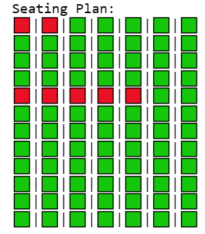

# Airplane Reservation System

This is a Python program that simulates an airplane reservation system. It allows users to book seats in different classes, view the seating plan, and perform other related actions.

## Features

The program includes the following features:

- Booking First Class seats.
- Booking Business Class seats.
- Booking Economy Class seats.
- Viewing the airplane seating plan.
- Displaying the fare for each class.
- Resetting the system.
- Exiting the booking system.

## Code Structure

The code is organized into several functions:

- `readWriteData(filename, operation)`: Reads and writes seat reservation data to a file.
- `bookFirstClass(noOfSeats)`: Books First Class seats.
- `bookBusinessClass(noOfSeats)`: Books Business Class seats.
- `bookEconomyClass(noOfSeats)`: Books Economy Class seats.
- `checkAvailableSeats(className)`: Checks the availability of seats in a specified class.
- `getFare()`: Displays the fare for each class.
- `viewSeatingPlan()`: Displays the airplane seating plan.
- `viewGraph()`: Generates and displays a graphical representation of the seating plan.
- `systemReset()`: Resets the system, clearing all seat reservations.
- `menu()`: Displays the main menu.
- `main()`: The main function that controls the program's flow.

## Usage

To use the program, follow these steps:

1. Clone or download the repository.
2. Run the `main()` function.
3. Select options from the main menu to book seats, view the seating plan, get fare information, reset the system, or exit.

## Sample Usage

Here's an example of how to use the program:

1. Run the program.
2. Choose option 1 to book First Class seats.
3. Enter the number of seats to book.
4. Choose option 3 to book Economy Class seats.
5. Enter the number of seats to book.
6. Choose option 4 to view the seating plan.

## Screenshots



## Dependencies

The program uses the following Python libraries:

- NumPy
- Matplotlib

You can install these dependencies using `pip`:

```bash
pip install numpy matplotlib

